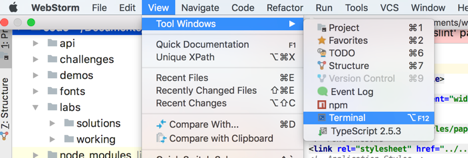
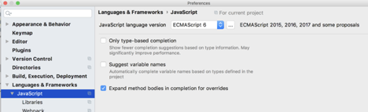
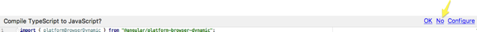
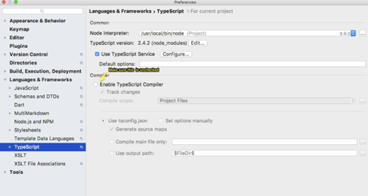
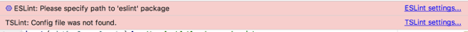
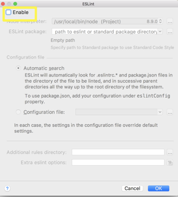
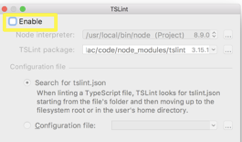
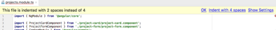
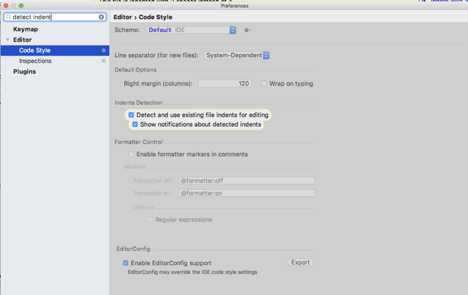
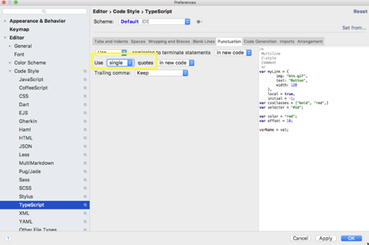

# Webstorm Configuration

## Contents

- [Webstorm Configuration](#Webstorm-Configuration)
  - [Contents](#Contents)
  - [Settings/Preferences](#SettingsPreferences)
  - [Open Embedded Command Prompt or Terminal](#Open-Embedded-Command-Prompt-or-Terminal)
  - [Language](#Language)
  - [Compile TypeScript to JavaScript](#Compile-TypeScript-to-JavaScript)
  - [Linting](#Linting)
  - [Indentation](#Indentation)
  - [Single Quote When WebStorm Auto Creates Imports](#Single-Quote-When-WebStorm-Auto-Creates-Imports)
  - [Prettier](#Prettier)
  - [Shortcuts](#Shortcuts)
  - [Tips](#Tips)

## Settings/Preferences

- `File | Settings` (for Windows and Linux)
- `WebStorm | Preferences` (for macOS)
- [For more information](https://www.jetbrains.com/help/webstorm/settings-preferences-dialog.html)

## Open Embedded Command Prompt or Terminal



## Language

`Settings> Languages & Frameworks > JavaScript> JavaScript Language Version> ECMAScript 6`




## Compile TypeScript to JavaScript

Answer `No` as shown below:



If you already clicked OK…
* `Preferences> Languages & Frameworks> TypeScript`



## Linting







## Indentation



- Add [this file](https://raw.githubusercontent.com/angular/angular/master/.editorconfig) to root of project


- Or turn off Indents Detection as shown below



## Single Quote When WebStorm Auto Creates Imports
`Preferences > Editor > Code Style > TypeScript > Use single quotes`



## Prettier

To install prettier globally:

```
npm install --global prettier
```

To find the path where prettier was installed run the command:

```
npm get prefix
```

To tell Webstorm where prettier is:
`Preferences> Languages & Frameworks & JavaScript > Prettier`
Set path to location of prettier

To configure:
Create the file: `AngularCourse...\code\prettier.config.js`
Add the following code:

```js
module.exports = {
  singleQuote: true
};
```

To configure a file watcher to run prettier on every save:
* Go to `Preferences | Tools | File Watchers`
* Click `+` to add a new watcher.
* Select `Prettier` from the list
* Set:
`Language: TypeScript`
`Program: prettier`

> Note: This works because prettier is in the path.

https://prettier.io/docs/en/webstorm.html

## Shortcuts

* `option + enter` - suggestion
* `cmd + 1`  - to open close project explorer
* `fn + alt + f12` - to open close terminal
* `ctrl + tab` - to switch files quickly

## Tips

- https://www.sitepoint.com/productivity-tips-for-webstorm-and-angular-part-1/
- https://www.sitepoint.com/productivity-tips-for-webstorm-and-angular-part-2/
